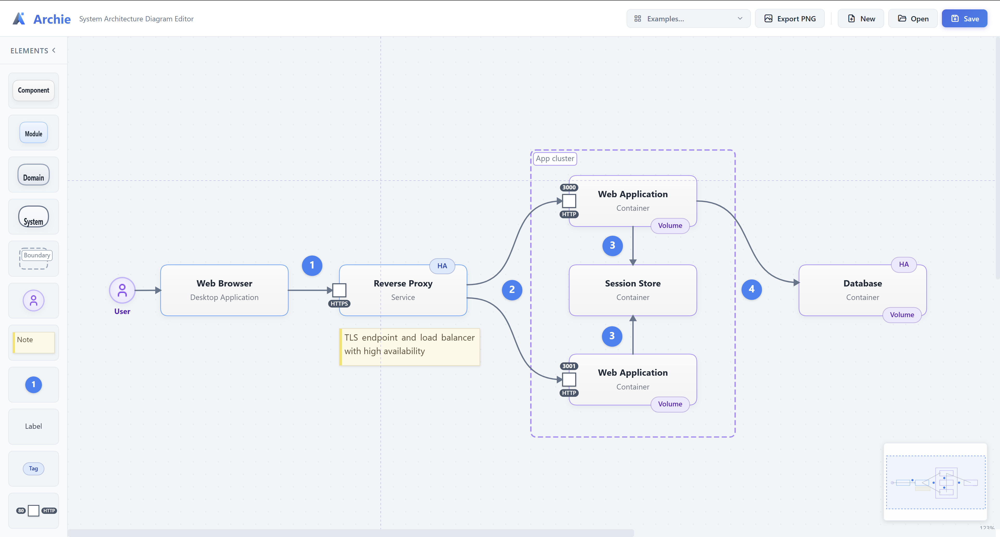

# Archie — System Architecture Diagram Editor

A canvas-based system architecture diagram editor built with TypeScript and Bun. Design architecture diagrams using a rich palette of elements, connect them with styled Bézier curves, and export or embed the result anywhere.

**[Open the editor →](https://julien-paoletti.github.io/archie/)**



---

## Elements

| Element | Description |
| --------- | ----------- |
| **Component** | Rectangular block with title, optional description and icon |
| **User** | Circular shape representing a human actor |
| **Module** | Container grouping related components (auto-layout) |
| **Domain** | Higher-level container grouping modules and components |
| **System** | Top-level container grouping domains |
| **Boundary** | Dashed border for visual grouping — configurable label position |
| **Note** | Multi-line annotation with color themes and optional icon |
| **Port** | Named connection point snapped to a component border |
| **Label** | Plain text, no background |
| **Tag** | Compact colored label |
| **Numbered Dot** | Free-floating numbered marker, always rendered on top |

Drag any element from the palette onto the canvas. Double-click to edit its title inline. Resize with corner and edge handles. `Ctrl+Drag` to clone.

---

## Connections

- Drag from a border connection point to another element to create a connection
- Multi-segment curves with draggable control handles
- Catmull-Rom mode — curve passes through anchor positions without handle editing
- Add or remove intermediate anchor points via right-click
- Line styles: **solid**, **dashed**, **dotted**
- Arrow styles: **filled**, **outline**, **line**, **none**
- Custom stroke color and inline label

---

## Features

### Canvas & Navigation

- Snap to grid (20 px)
- Zoom with scroll wheel, pan with `Space+Drag` or middle-click
- Minimap for navigating large diagrams
- Crosshair guides

### File Management

- Open and save `.json` files via the File System Access API
- No dialog on subsequent saves — the opened file handle is reused
- Auto-save to `localStorage` between sessions
- Viewport (zoom & pan) persisted and restored on reload
- Three built-in example diagrams available from the **Examples** dropdown

### Editing

- Undo / Redo — up to 50 history steps (`Ctrl+Z` / `Ctrl+Y`)
- Copy, Cut, Paste — cross-session clipboard
- Box selection — drag on empty canvas
- Multi-select with `Shift+Click`
- Align selected elements horizontally or vertically via context menu
- Group a selection into a Module via context menu
- Export diagram or selection as **PNG**

### Context Menu

| Target | Actions |
| ------ | ------- |
| Connection | Edit label · Line style · Arrow type · Stroke color · Add/remove anchor · Reset curve · Delete |
| Component | Edit description · Border color |
| Note | Color theme · Icon · Icon position · Font size |
| Tag | Color theme |
| Boundary | Label position (4 corners) |
| Multi-selection | Align vertically · Align horizontally · Group into Module |

---

## Keyboard Shortcuts

| Shortcut | Action |
| -------- | ------ |
| `Ctrl/Cmd + S` | Save |
| `Ctrl/Cmd + O` | Open |
| `Ctrl/Cmd + N` | New diagram |
| `Ctrl/Cmd + Z` | Undo |
| `Ctrl/Cmd + Y` / `Ctrl/Cmd + Shift + Z` | Redo |
| `Ctrl/Cmd + A` | Select all |
| `Ctrl/Cmd + C` | Copy |
| `Ctrl/Cmd + X` | Cut |
| `Ctrl/Cmd + V` | Paste |
| `Ctrl/Cmd + Drag` | Clone element |
| `Shift + Drag` | Constrain movement to one axis |
| `Shift + Click` | Toggle multi-selection |
| `Space + Drag` | Pan canvas |
| `Scroll wheel` | Zoom |
| `Delete` / `Backspace` | Delete selected |
| `Escape` | Clear selection |

---

## Archie Viewer

The `@julien-paoletti/archie-viewer` package provides a lightweight, read-only canvas viewer for embedding Archie diagrams in any TypeScript or JavaScript project.

### Installation

```bash
npm install @julien-paoletti/archie-viewer \
  --registry https://npm.pkg.github.com
```

### Usage

```typescript
import { ArchieViewer } from '@julien-paoletti/archie-viewer';
import type { SerializedDiagram } from '@julien-paoletti/archie-viewer';

const viewer = new ArchieViewer('my-canvas', { fitPadding: 40 });

const diagram: SerializedDiagram = await fetch('/diagrams/infra.json')
  .then(r => r.json());

viewer.load(diagram);
viewer.fitToContent();

// Clean up when the host component unmounts
viewer.destroy();
```

The canvas just needs to exist in the DOM — no wrapper divs required. Pan with middle-click or `Alt+Drag`; zoom with `Ctrl+Wheel`. The viewer is purely read-only: no selection, drag, or context menus.

### Releasing a new viewer version

Bump the version in `viewer/package.json`, then:

```bash
git add viewer/package.json
git commit -m "chore: bump viewer to x.y.z"
git tag vx.y.z
git push && git push --tags
```

The `publish-viewer` GitHub Actions workflow will build and publish the package to GitHub Packages automatically.

---

## Development

### Prerequisites

[Bun](https://bun.sh) >= 1.0

### Setup

```bash
git clone https://github.com/julien-paoletti/archie.git
cd archie
bun install
```

### Commands

| Command | Description |
| ------- | ----------- |
| `bun run dev` | Watch mode — bundles to `src/dist/` |
| `bun run serve` | Dev server at `http://localhost:3000` |
| `bun run build` | Production build to `docs/` |
| `bun run build:viewer` | Build the viewer npm package |

### Project structure

```text
archie/
├── src/
│   ├── index.html          # App entry point
│   ├── app.ts              # Bootstrap, toolbar, file management
│   ├── editor.ts           # Editor coordinator (thin, delegates to handlers)
│   ├── canvas/             # Element classes, connection math, rendering
│   ├── editor/             # Handler modules: mouse, keyboard, serialization…
│   ├── demos/              # Built-in example diagrams (JSON)
│   └── css/styles.css
├── viewer/                 # Standalone viewer npm package
│   ├── src/
│   │   ├── viewer.ts       # ArchieViewer class
│   │   └── index.ts        # Public API
│   └── package.json
├── scripts/
│   ├── build.ts            # Production build script
│   └── serve.ts            # Dev server
└── docs/                   # GitHub Pages output
```

### Deployment

Pushing to `trunk` triggers the `deploy` workflow which builds the app and publishes it to GitHub Pages at [julien-paoletti.github.io/archie](https://julien-paoletti.github.io/archie/).

---

Made with ❤️ in Bordeaux
